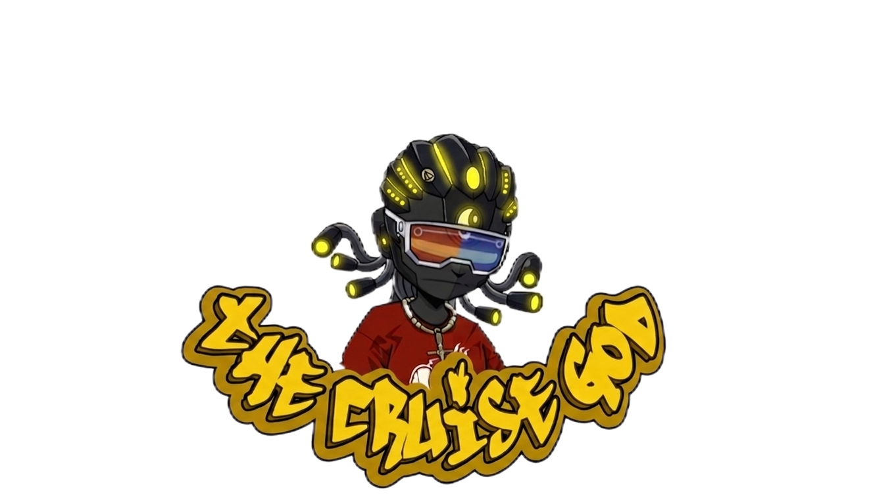

<p align="center">
  
</p>

<h1 align="center">TCG — The Cruise God</h1>

<p align="center">
  <strong>The first multiplayer voice AI concierge, game master, and local guide — built for groups.</strong>
</p>

<p align="center">
  <a href="https://thecruisegod.vercel.app/">Live Demo</a> ·
  <a href="#features">Features</a> ·
  <a href="#architecture">Architecture</a> ·
  <a href="#getting-started">Getting Started</a>
</p>

---

## What is TCG?

TCG is a voice-first AI application that replaces the "where should we go?" group chat, the "who's keeping score?" argument, and the "find me a barber" Google spiral with a single conversational agent.

You talk to TCG like a charismatic friend who knows every spot in your city, and it **physically controls the UI** while you speak — switching modes, opening party tools, displaying live search results, and capturing shareable memories.

What makes it different from every other voice assistant: **it's multiplayer.** Your entire friend group can scan a QR code, join the same session, send dares, queue songs, and speak directly to the AI through CruiseHQ.

> [!TIP]
> Built for the [ElevenHacks Hackathon](https://elevenlabs.io) using **ElevenLabs Conversational AI**, **Firecrawl Search API**, **Supabase Realtime**, and **Gemini Vision**.

## Features

### 🎙️ Voice-Controlled UI with 10 Client Tools

The ElevenLabs agent doesn't just reply — it **drives the interface**. Through registered Client Tools, the agent autonomously:

| Client Tool | What It Does |
|---|---|
| `switchMode` | Snaps the UI between Locator, Plug, Game Master, and Tools |
| `openTool` | Opens a specific party tool (coin, dice, bottle, randomizer, timer) |
| `createMemory` | Captures a screenshot via `html2canvas`, uploads to Supabase Storage, saves a Trophy with a viral `shareCaption` |
| `updateGameState` | Updates the Game Session dashboard (players, scores, turns, rules) |
| `displayResults` | Populates search result cards from Firecrawl data |
| `showQR` | Displays the CruiseHQ QR code (dynamically generated via `api.qrserver.com`) |
| `randomizeGroups` | Shuffles active guests into groups (supports auto, self-select, and smart mode sorting) |
| `setGroupLeader` | Elects and announces a specific guest as the captain of their group |
| `analyzeImage` | Opens camera for OCR/Vision (bill splitting, NAFDAC/barcode verification, drink checks, game vision) |
| `captureScreen` | Instant screenshot memory with auto-generated caption |

### 🧠 Engineered System Prompt

The agent prompt is constructed with structured XML tags:

- `<dynamic_context>` — User name, location, current mode, room code, active guests, and wingman preferences injected at session start
- `<role>` — TCG persona definition ("world-class AI concierge, local expert, and game master")
- `<personality_core>` — Energy matching, personalization, humor style, brevity rules, cultural awareness
- `<core_workflows>` — 6 numbered workflows mapping intents to tool chains
- `<critical_behaviors>` — Latency management (filler words before tool execution), barge-in recovery, proactive memory captures (max 2-3/session)
- `<advanced_nlp_handling>` — Multi-threaded request triage, slang comprehension, auto-pivot on interruptions

### 🔍 Firecrawl-Powered Live Search

Every search goes through a production-grade 3-tier pipeline:

1. **Supabase Persistent DB** — 7-day TTL cache of previous results
2. **Upstash Redis** — 15-minute fast cache for repeat queries
3. **Firecrawl Search API** — live web scrape with dynamic query formulation

Queries are context-aware. Asking for a "wild game for 6 people" generates `"for 6 players wild hilarious high-energy party game rules"`. Game searches extract full Markdown rules so the agent can teach players how to play.

### 👥 CruiseHQ — Multiplayer Rooms

The host generates a 4-character room code. Guests visit `/room/{CODE}` on their phones and join via Supabase Realtime Presence.

**Group System:** The host (or agent via `randomizeGroups` tool) can split guests into named groups. CruiseHQ provides tabbed chat with a **Main Room** and a tab per group — messages are scoped by group so private team discussions stay private.

**In-Room Decision Tools:**

- 📊 **Polls** — Any participant can create a poll with custom options and optional anonymous voting. Votes aggregate in real-time across all connected clients via Supabase Broadcast.
- 🎯 **Randomizer** — A slot-machine-style picker that auto-loads the active group members. Spin to pick a random person for a dare, a round, or any decision.

**Guest Actions from `/room/{CODE}`:**

| Action | What Happens |
|---|---|
| 💬 Chat | Message appears in the host's CruiseHQ |
| 🔥 Dare | Injected into the voice agent's context |
| 🤫 Truth | Injected into the voice agent's context |
| 🎵 Song | Song request queued to the host |
| 🎭 Charades | Charades word sent to the host |
| Tag **@TCG** | The AI responds directly to the guest |
| 🎙️ Request Co-host | Host approves → guest gets a remote mic via SpeechRecognition |
| 📸 Save to Memories | Any chat message can be captured as a Trophy |

The agent is aware of all guests in real-time. When someone joins or leaves, it acknowledges them by name.

**Cruiser Roster Modal:** The host can tap the "👥 N Cruisers" badge to open a full-screen roster showing all connected guests with their group badges. Quick Action buttons let the host split guests 50/50, into 3 groups, or reset groups — all in one tap.

**Push to Screen:** Guests can push images to the host's screen. The image appears as a dramatic full-screen overlay (with `zoom-out` dismiss) — perfect for sharing memes, photos, or evidence mid-conversation.

**Co-host Voice Injection:** Approved co-hosts speak through their phone's browser SpeechRecognition API. Their transcribed speech is injected directly into the ElevenLabs session via `conversation.sendUserMessage()`, so TCG hears and responds to them naturally.

**Charades Hidden Word:** When a guest submits a charades word, the host's transcript shows `[HIDDEN]` to prevent cheating — only the agent knows the word.

### 📸 Vision System

Point your camera at anything and TCG analyzes it:

- **Bill Scanner** — Reads receipt totals and extracts currency, splitting the bill globally
- **Actionable Drink Checks** — OCR extracts barcodes (queried via Open Food Facts API) and NAFDAC numbers (verified via Firecrawl scrape) to confirm product authenticity
- **Game Vision** — Identifies board/card game state and suggests next moves
- **User-Directed Analysis** — Users can type custom instructions while snapping a photo to override the default task logic

Powered by Gemini Vision API with structured JSON output fed back into the voice conversation.

### 🎲 9 Party Tools

All voice-activatable and multiplayer-aware:

| Tool | Description |
|---|---|
| 🪙 Coin Flip | Animated coin with heads/tails |
| 🎲 Dice Roll | 1–6 dice, 2–100 sides |
| 🍾 Spin the Bottle | SVG wheel synced with room guests |
| 🎯 Randomizer | Slot-machine picker, loadable from guest list |
| ⏱ Timer / Stopwatch | Circular progress, configurable countdown |
| 💰 Bill Splitter | Global location-aware currency calculation |
| 🃏 Truth or Dare | 3 intensity levels (Mild / Spicy / Savage) |
| 🎭 Charades | 4 categories including Hardcore |
| 🏆 Scoreboard | Auto-synced with CruiseHQ guests |

### 🏆 Trophy Room & Memory System

Memorable moments are captured as screenshots via `html2canvas`, uploaded to Supabase Storage, and displayed in a shareable gallery at `/trophy-room`. The agent proactively suggests captures (max 2-3 per session) and generates viral `shareCaption` text.

**Memory Types:** `location_drop` · `game_win` · `plug_moment` · `cruisehq_quote` · `party_milestone` · `group_capture` · `moment`

**Manual Capture:** A floating 📸 button (FAB) lets the user manually save a memory at any time, independent of voice.

### 🌊 Waveform Visualizer

A full-width animated waveform sits behind the character avatar. It reacts to agent state (speaking vs. listening) and changes color per mode: green for Locator, gold for Plug, red for Game Master.

### ⚙️ Settings & Wingman Protocols

- **Settings Modal** — Quick name change without leaving the conversation
- **Profile Page (`/profile`)** — Persistent display name and **Wingman Protocols** (e.g., "Always suggest dive bars", "Keep it PG", "Roast me constantly"). These are injected into the system prompt at session start
- **Dynamic Agent Selection** — The ElevenLabs Agent ID is configurable, allowing different voice personas

### 💬 Chat Fallback

A slide-up transcript drawer provides full text chat. Users can type messages (routed into the live ElevenLabs session via `sendUserMessage()`), view the conversation history, browse search result cards, and push images to full-screen.

## Architecture

```
┌─────────────────────────────────────────────────────┐
│                    Next.js App                       │
│                                                     │
│  ┌───────────┐  ┌────────────┐  ┌────────────────┐ │
│  │ ElevenLabs│  │  Firecrawl │  │ Supabase       │ │
│  │ Client    │  │  Search    │  │ Realtime +     │ │
│  │ Tools     │──│  Pipeline  │  │ Auth + Storage │ │
│  └─────┬─────┘  └──────┬─────┘  └───────┬────────┘ │
│        │               │                │          │
│  ┌─────▼─────────────────────────────────▼────────┐ │
│  │         ConversationManager (Orchestrator)      │ │
│  └─────────────────────┬───────────────────────────┘ │
│                        │                             │
│  ┌──────┬──────┬───────┼───────┬──────┬───────────┐ │
│  │Modes │Tools │CruiseHQ│Vision│Trophy│  Profile  │ │
│  │      │Panel │  Room  │Camera│ Room │  + Admin  │ │
│  └──────┴──────┴───────┴──────┴──────┴───────────┘ │
└─────────────────────────────────────────────────────┘

External APIs:
  • ElevenLabs Conversational AI (voice + client tools)
  • Firecrawl Search API (live web scraping + NAFDAC portal bypassing)
  • Gemini Vision API (image analysis)
  • Open Food Facts API (global barcode product lookup)
  • Google Maps Geocoding (reverse location lookup)
  • Upstash Redis (caching + rate limiting)
  • Supabase (PostgreSQL, Realtime, Auth, Storage)
  • Sentry (error monitoring)
```

## Tech Stack

| Layer | Technology |
|---|---|
| Framework | Next.js 15 (App Router, Edge Runtime) |
| Voice AI | ElevenLabs Conversational AI (`@elevenlabs/react`) |
| Live Search | Firecrawl Search API / Scrape API |
| Database | Supabase PostgreSQL with RLS |
| Realtime | Supabase Channels (Presence + Broadcast) |
| Auth | Supabase Auth (email/password) |
| Storage | Supabase Storage (trophy screenshots) |
| Caching | Upstash Redis |
| Vision | Google Gemini 2.5 Flash |
| External Data | Open Food Facts (Barcodes) |
| Geocoding | Google Maps API |
| Animations | Framer Motion |
| Monitoring | Sentry |
| Deployment | Vercel |

## Getting Started

### Prerequisites

- Node.js 18+
- pnpm (recommended) or npm
- Accounts on: [ElevenLabs](https://elevenlabs.io), [Firecrawl](https://firecrawl.dev), [Supabase](https://supabase.com), [Upstash](https://upstash.com)

### 1. Clone and install

```bash
git clone https://github.com/kryptopacy/TCG-TheCruiseGod.git
cd TCG-TheCruiseGod/app
pnpm install
```

### 2. Configure environment

```bash
cp .env.template .env.local
```

Fill in the required keys:

```env
# Core Agent
ELEVENLABS_API_KEY=your_key
NEXT_PUBLIC_AGENT_ID=your_agent_id
FIRECRAWL_API_KEY=your_key

# Location Services
NEXT_PUBLIC_GOOGLE_MAPS_API_KEY=your_key

# Database & Auth
NEXT_PUBLIC_SUPABASE_URL=your_url
NEXT_PUBLIC_SUPABASE_ANON_KEY=your_key

# Caching & Rate Limiting
UPSTASH_REDIS_REST_URL=your_url
UPSTASH_REDIS_REST_TOKEN=your_token
```

### 3. Set up the ElevenLabs Agent

Follow the instructions in [`ELEVENLABS_SETUP_FINAL.md`](./ELEVENLABS_SETUP_FINAL.md) to configure your agent's persona. All **10** required Client Tools are defined in [`elevenlabs_json_tools.md`](./elevenlabs_json_tools.md).

### 4. Run locally

```bash
pnpm dev
```

Open [http://localhost:3000](http://localhost:3000). Tap the character to connect.

### 5. Deploy

```bash
vercel --prod
```

> [!IMPORTANT]
> Add your Vercel domain to the ElevenLabs agent's **Allowed Origins** to prevent CORS errors in production.

## Project Structure

```
app/
├── src/app/
│   ├── api/
│   │   ├── get-signed-url/    # ElevenLabs session auth
│   │   ├── search/            # Firecrawl location search
│   │   ├── search-games/      # Firecrawl game rules search
│   │   ├── search-plugs/      # Firecrawl service search
│   │   └── vision/            # Gemini Vision analysis
│   ├── components/
│   │   ├── ConversationManager.tsx  # Core orchestrator (1000+ lines)
│   │   ├── CruiseHQ.tsx            # Multiplayer chat room
│   │   ├── ToolsPanel.tsx          # 9 party tools
│   │   ├── CameraCapture.tsx       # Vision camera UI
│   │   └── ...
│   ├── hooks/                 # useDeviceLocation, useTrophyCapture
│   ├── lib/
│   │   ├── firecrawl.ts       # 3-tier search pipeline
│   │   └── db.ts              # Supabase/localStorage persistence
│   ├── room/[id]/             # Guest join page
│   ├── trophy-room/           # Memory gallery
│   ├── profile/               # Wingman preferences
│   ├── admin/                 # Demo/Production mode toggle
│   └── login/                 # Supabase auth
└── public/                    # TCG character, logo, PWA assets
```

## How It Uses ElevenLabs

TCG pushes ElevenLabs beyond basic TTS/STT:

- **Client Tools** — The voice agent autonomously calls `switchMode()`, `openTool()`, `showQR()`, and `analyzeImage()` to control the React frontend in real-time
- **Dynamic System Prompt** — User name, location, active guests, room code, and wingman preferences are injected into the prompt at session start
- **Multiplayer Injection** — Guest messages, dares, and @mentions are routed into the live session via `conversation.sendUserMessage()`

## How It Uses Firecrawl

The Firecrawl integration goes far beyond a basic search wrapper:

- **Dynamic Query Engine** — Translates conversational intent into structured search queries with contextual modifiers (energy level, urgency, player count)
- **Selective Deep Scrape** — Game searches request `markdown` format to extract full rule sets for voice readback
- **Verification Scraper** — The Vision API uses Firecrawl's `/v1/scrape` endpoint to bypass CORS and load NAFDAC portals, parsing raw Markdown back to authenticate scanned products
- **3-Tier Cache** — Supabase (7-day) → Redis (15-min) → Firecrawl API. Aggressively mitigates rate limits and costs
- **Background Persistence** — Fresh results are asynchronously saved to Supabase tables (`tcg_locations`, `tcg_games`, `tcg_plugs`) for future instant retrieval
